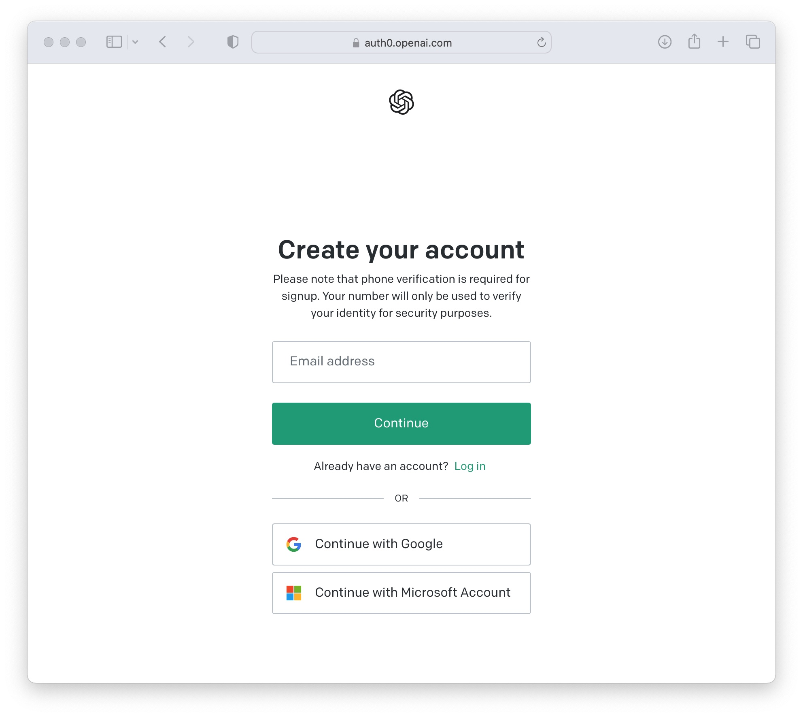
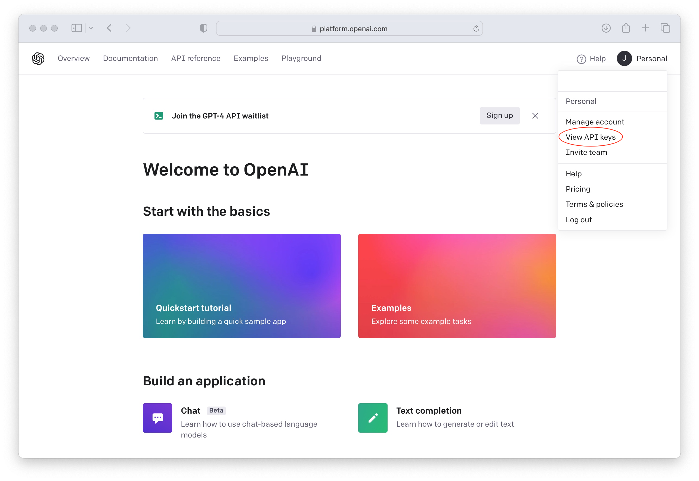
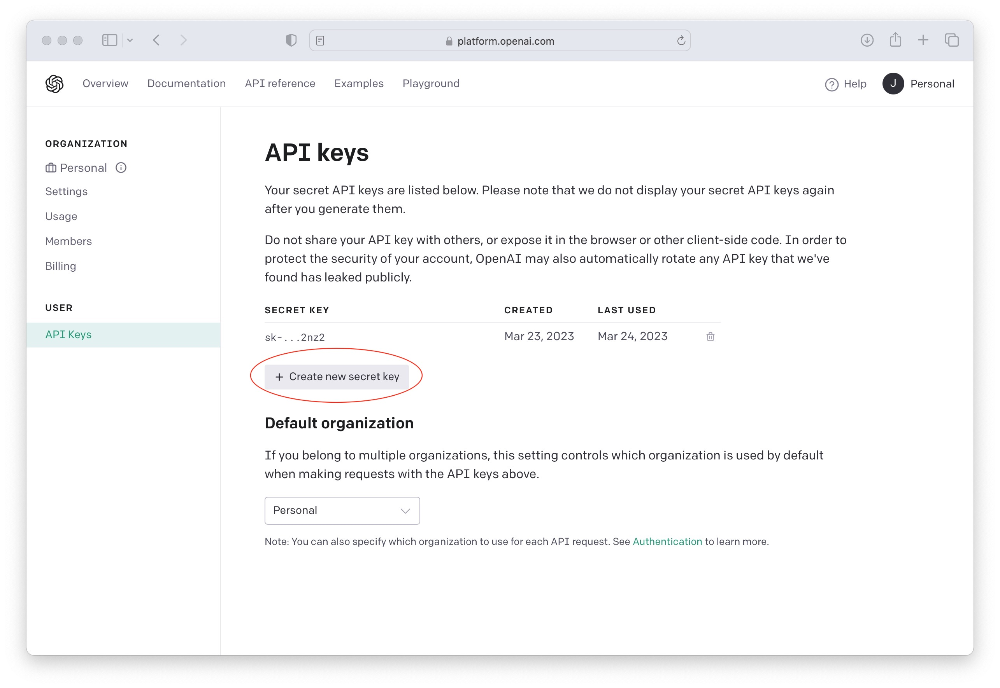
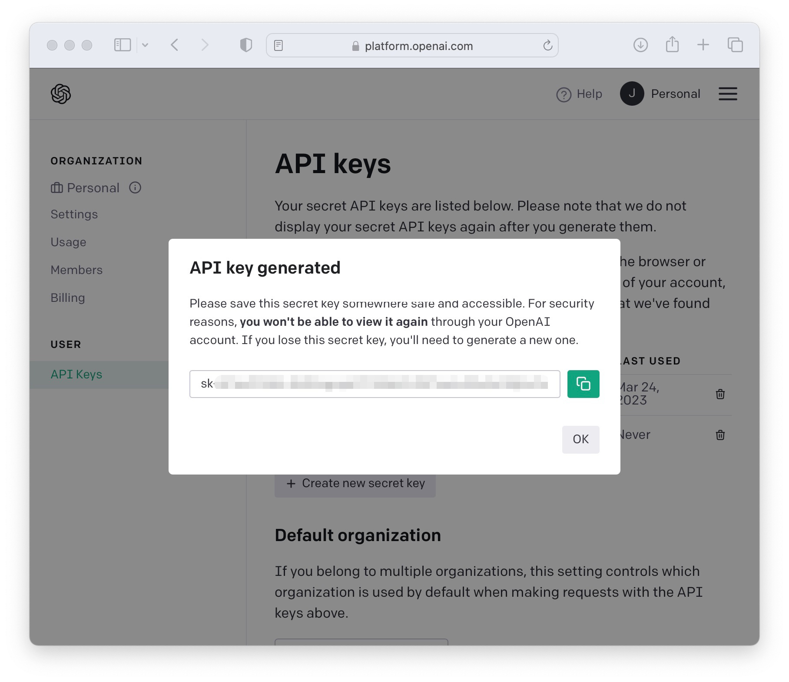

# Setting 
## 1. How to Find your Secret API Key in your OpenAI Account

First sign in or sign up for your OpenAI account. You can find sign up and login link here: [https://platform.openai.com](https://platform.openai.com)

  

## 2. Once logged in, click on your profile name or Icon to open the menu.Then select the 'View API Keys' option as highlighted in the screenshot below.

  

## 3. On the API Keys page, you will see a list of existing Secret Keys.  Just select 'Create new secret key' to generate a new key to use your your client integrations like when you want to sue ChatGPT into your Live Chat chatbots.

  

## 4. Then click the green icon on the popup page to copy your OpenAI secret key to a safe place.

  

